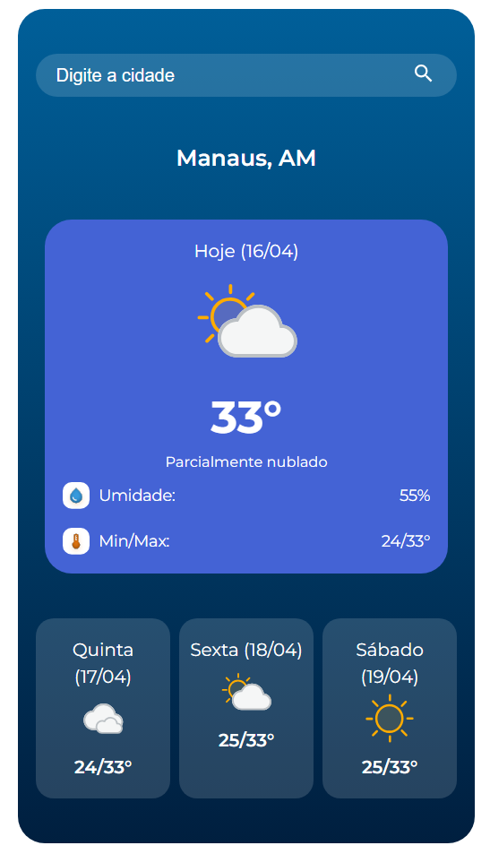

# Climapp

App de clima que consome uma API e exibe informações como temperatura e data atual, descrição do tempo, umidade, máx e min e previsão para os próximos dias.

🔗 **Acesse:** [climapp-gamma.vercel.app](https://climapp-gamma.vercel.app)

> ⚠️ É necessário **permitir o acesso à localização** no navegador para que o clima da sua região seja exibido automaticamente.

## 🔨 Funcionalidades do projeto

O App permite buscar uma cidade, qualquer cidade do Brasil, e mostra a temperatura atual, exibe um ícone mostrando o tempo, descrição do clima, umidade, temperaturas máximas e mínimas e previsão para os próximos dias. Também exibe o clima atual da localização do usuário (via geolocalização do navegador)



## ✔️ Técnicas e tecnologias utilizadas

As técnicas e tecnologias utilizadas pra isso são:

- `React`: biblioteca de interface de usuários
- `CSS`: para estilos da aplicação
- `Vite`: ferramenta de build do app
- `Figma`: para prototipar o app
- `HG Brasil`: site da API utilizada para obter informações do clima

## 🛠️ Abrir e rodar o projeto

1. Clone o repositório
```bash
git clone <url-do-repositorio>
cd climapp
```
 
2. Instale as dependências
```bash
npm install
```
 
3. Crie um arquivo `.env` na raiz do projeto com sua chave da API:
```
VITE_WEATHER_API_KEY=sua_chave_aqui
```
 
4. Inicie o servidor de desenvolvimento
```bash
npm run dev
```

